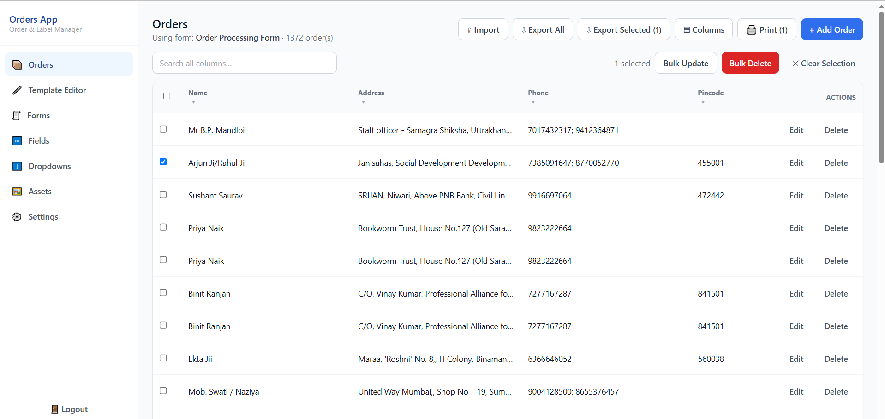
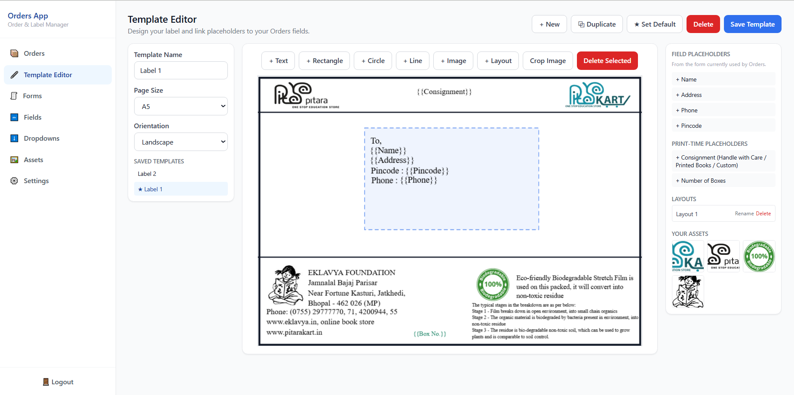
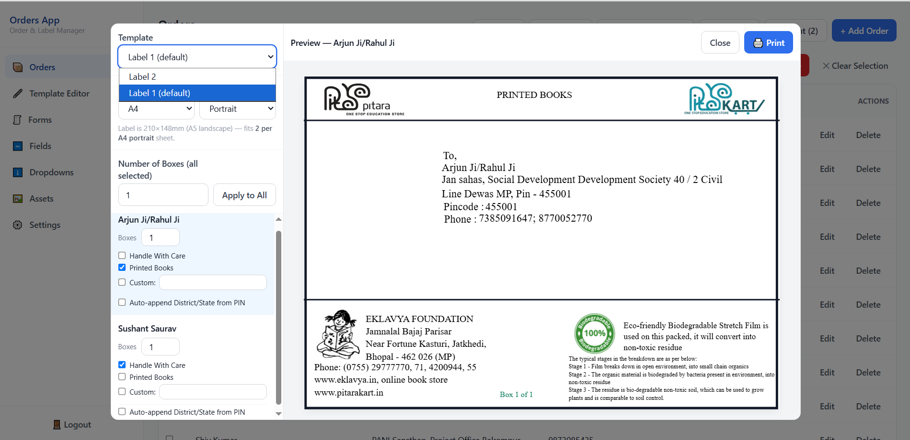

# Eklavya Pitara — Order & Label Management System

A local, single-admin web application for Eklavya Foundation's Eklavya Pitara program.

The system replaces the older Word-document-based workflow with a browser-based system for order management, label template design, and physical label printing.





## Features

- Dynamic/custom order fields
- Dynamic forms
- Dropdown management
- Excel-like order management
- Excel import/export
- Search, filtering, sorting, bulk editing and deletion
- Label template designing with Fabric.js
- Dynamic field placeholders
- Consignment and box-count placeholders
- Pincode-based address handling
- Image and branding asset management
- Physical-size accurate label printing
- Single-admin authentication
- Local development setup
- Docker production deployment
- Docker Hub image distribution
- Portainer deployment

---

# 1. Technology Stack

## Frontend

- React
- Vite
- Tailwind CSS
- Fabric.js
- Axios

## Backend

- Node.js
- Express.js
- MySQL2
- JWT
- Helmet
- CORS
- CSRF protection
- Rate limiting
- Multer
- ExcelJS

## Database

- MySQL 8+

## Production

- Docker
- Docker Hub
- Nginx
- Portainer

---

# 2. Application Architecture

The application supports two deployment modes:

1. **Local Development** — frontend and backend run directly with Node.js/npm.
2. **Production Docker Deployment** — frontend and backend run as Docker containers while MySQL remains an existing external MySQL server.

## Production Architecture

```text
                         User Browser
                              |
                              | HTTP :8074
                              v
                +---------------------------+
                | Frontend Container        |
                | React Production Build    |
                | Nginx                     |
                | Port 8074                 |
                +-------------+-------------+
                              |
                       /api and /uploads
                              |
                              v
                +---------------------------+
                | Backend Container         |
                | Node.js + Express         |
                | Port 8075                 |
                +-------------+-------------+
                              |
                              | MySQL :3306
                              v
                +---------------------------+
                | Existing MySQL Server     |
                | External to Compose       |
                +---------------------------+
```

## Production Ports

| Component | Container Port | Host Port | Purpose |
|---|---:|---:|---|
| Frontend / Nginx | 8074 | 8074 | Main web application |
| Backend / Express | 8075 | 8075 | API/backend |
| MySQL | 3306 | Existing server | External database |

Normal users should access:

```text
http://<SERVER_IP>:8074
```

---

# 3. Important Deployment Design

The production Docker Compose stack intentionally contains only:

- Backend
- Frontend
- One Docker network

MySQL is **not** included in Docker Compose.

The backend connects to an existing MySQL server using:

```text
DB_HOST
DB_PORT
DB_USER
DB_PASSWORD
DB_NAME
```

The Docker host must therefore be able to reach the MySQL server over the network.

---

# 4. Prerequisites

## 4.1 Local Development

Install:

- Node.js 18+
- npm
- MySQL 8+
- Git

The MySQL server must be running and reachable.

A MySQL database must already exist.

A MySQL user must have permission to access that database.

## 4.2 Docker Production Deployment

The production server should have:

- Linux
- Docker
- Docker Compose support
- Portainer, if using Portainer
- Network access to the external MySQL server
- Internet access to pull Docker images from Docker Hub

---

# 5. Database Setup

The application **does not create the MySQL database itself**.

The database must be created manually by the database administrator before starting the backend.

The application automatically creates/checks the required application tables inside the configured database when the backend starts.

## 5.1 Create the Database

Log in to MySQL:

```bash
mysql -u root -p
```

You may also use phpMyAdmin or another MySQL administration tool.

Create the database:

```sql
CREATE DATABASE database_name;
```

Create a MySQL user if required:

```sql
CREATE USER 'your_db_user'@'%' IDENTIFIED BY 'your_db_password';
```

Grant access:

```sql
GRANT ALL PRIVILEGES
ON db_name.*
TO 'your_db_user'@'%';

FLUSH PRIVILEGES;
```

Use the organization's actual database name, username, and password.

> **Security:** Never commit real database credentials to GitHub.

---

# 6. Local Development Setup

The local setup runs frontend and backend directly with Node.js/npm.

```text
Browser
   |
   | :5173
   v
React / Vite
   |
   | API :4000
   v
Node.js / Express
   |
   | :3306
   v
MySQL
```

## 6.1 Backend Setup

Open a terminal:

```bash
cd backend
```

Create the environment file:

```bash
cp .env.example .env
```

On Windows, create/copy the file manually if `cp` is unavailable.

Edit:

```text
backend/.env
```

Example:

```env
PORT=4000

DB_HOST=<YOUR_MYSQL_HOST>
DB_PORT=3306
DB_USER=<YOUR_DB_USER>
DB_PASSWORD=<YOUR_DB_PASSWORD>
DB_NAME=<YOUR_DB_NAME>

JWT_SECRET=<YOUR_LONG_RANDOM_JWT_SECRET>

CORS_ORIGINS=http://localhost:5173
```

Install dependencies:

```bash
npm install
```

Start the backend:

```bash
npm run dev
```

The backend normally runs at:

```text
http://localhost:4000
```

Because the backend listens on `0.0.0.0`, it can also be accessed from another device on the same LAN:

```text
http://<YOUR_MACHINE_LAN_IP>:4000
```

## 6.2 CORS for Local LAN Access

If the frontend is accessed from another LAN device, include its origin:

```env
CORS_ORIGINS=http://localhost:5173,http://192.168.1.50:5173
```

Replace `192.168.1.50` with the actual LAN IP.

Multiple origins are separated by commas.

---

# 7. Frontend Local Setup

Open a second terminal:

```bash
cd frontend
```

Create the environment file:

```bash
cp .env.example .env
```

Install dependencies:

```bash
npm install
```

Configure:

```text
frontend/.env
```

Example:

```env
VITE_API_URL=http://localhost:4000
VITE_PORT=5173
```

Start the frontend:

```bash
npm run dev
```

Open:

```text
http://localhost:5173
```

## 7.1 Frontend Development Port

The Vite development port is controlled by:

```env
VITE_PORT=5173
```

For example:

```env
VITE_PORT=8075
```

The frontend would then run on:

```text
http://localhost:8075
```

If `VITE_PORT` is omitted, Vite falls back to:

```text
5173
```

The Vite configuration uses `host: true`, so LAN access is also possible:

```text
http://<YOUR_MACHINE_LAN_IP>:5173
```

## 7.2 Backend API URL

Local development normally uses:

```env
VITE_API_URL=http://localhost:4000
```

If the backend is on another machine:

```env
VITE_API_URL=http://<BACKEND_HOST>:4000
```

After changing `VITE_PORT` or `VITE_API_URL`, restart:

```bash
npm run dev
```

> **Note:** `VITE_PORT` controls the frontend development/preview server port, while `VITE_API_URL` controls the backend API URL. These are independent settings.

---

# 8. First Run

Open the frontend in your browser.

If no administrator account exists, the application displays the one-time Setup screen.

It asks for:

- Email
- Password
- Retype Password

The email address acts as the username. There is no separate username field.

After setup, the application redirects to the login screen.

---

# 9. Suggested First-Time Application Flow

## 9.1 Fields

Create the fields required by the organization.

Examples:

- Customer Name
- Address
- Mobile Number
- Pincode
- Order Date
- Region
- Delivery Mode

Supported field types include:

- Short Text
- Multiline Text
- Number
- Date
- Dropdown
- Toggle

Field names are dynamic and configurable. The application does not depend on fixed names such as Address, District, State, or Pincode.

## 9.2 Dropdowns

Create dropdowns and their options before assigning them to fields.

Examples:

- Region
- Delivery Mode
- Order Type

## 9.3 Forms

Create a Form, select its Fields, and drag to reorder them.

## 9.4 Orders

When Orders is opened for the first time, select the Form that drives the Orders table.

Orders supports:

- Adding orders
- Editing orders
- Searching
- Column filtering
- Sorting
- Bulk editing
- Bulk deletion
- Excel import
- Excel export
- Selecting orders for printing

## 9.5 Template Editor

Use Template Editor to design labels.

Supported page sizes:

- A3
- A4
- A5
- Letter
- Envelope

Supported editor content:

- Text
- Shapes
- Images
- Dynamic field placeholders
- Consignment placeholder
- Number of Boxes placeholder

Templates can be saved and optionally marked as the default.

## 9.6 Printing

1. Select one or more orders.
2. Click **Print**.
3. Configure box count and consignment options.
4. Apply a box count to all selected orders if required.
5. Open the browser print dialog.
6. Print.

For physical accuracy, use:

```text
100% / Actual Size
```

Do not use:

```text
Fit to Page
```

---

# 10. Important Implementation Notes

## 10.1 Order Search / Filter / Sort

Order search, filtering, and sorting are performed in the backend after loading the form's orders into memory.

The application does not perform raw SQL `WHERE`/`LIKE` filtering directly on the JSON column.

This is intended for the realistic scale of a single office's orders.

If the order volume grows significantly and listing becomes slow, this area can be optimized using generated/indexed columns for frequently searched fields.

## 10.2 Excel Import Matching

The **first field in the Orders form** is used as the unique key for duplicate detection during Excel re-import.

For example, make the first field:

```text
Order Number
```

Existing key:

```text
Update existing order
```

New key:

```text
Create new order
```

It is therefore recommended that the first Orders field contain a value unique per order.

## 10.3 Image Cropping

Image cropping works by:

1. Dragging a crop-window rectangle over the image.
2. Clicking **Apply Crop**.

The crop rectangle is defined in canvas coordinates and works with rotated images.

## 10.4 Physical Print Accuracy

The canvas uses true physical dimensions for supported page sizes.

For example:

```text
A4 = 210 × 297 mm
```

Use:

```text
100% / Actual Size
```

in the browser print dialog.

Do not use:

```text
Fit to Page
```

The Envelope size uses a common DL size:

```text
110 × 220 mm
```

If the office uses another envelope size, update:

```text
frontend/src/utils/pageSizes.js
```

---

# 11. Security

The backend includes:

- Helmet security headers
- CORS allow-listing
- General API rate limiting
- Login-specific rate limiting
- httpOnly authentication cookies
- CSRF protection
- Parameterized SQL queries
- JWT-based authentication
- Single-admin setup flow

Production credentials must never be committed to GitHub.

---

# 12. Docker Production Deployment

Production uses pre-built Docker images hosted on Docker Hub.

```text
Source Code
    |
    | docker build
    v
Docker Images
    |
    | docker push
    v
Docker Hub
    |
    | docker pull
    v
Linux Server / Portainer
    |
    +-----------------------+
    |                       |
    v                       v
Backend Container      Frontend Container
    :8075                   :8074
    |                       |
    +-----------+-----------+
                |
                v
       External MySQL Server
```

---

# 13. Docker Images

Backend image:

```text
syedhamza6265/order-processing-management-backend
```

Frontend image:

```text
syedhamza6265/order-processing-management-frontend
```

Use versioned tags such as:

```text
1.0.0
1.0.1
1.0.2
```

Always ensure the Compose file references the exact version that has been built and pushed.

---

# 14. Docker Files

Backend:

```text
backend/Dockerfile
```

Frontend:

```text
frontend/Dockerfile
frontend/nginx.conf
```

The backend image uses Node.js Alpine, installs production dependencies, copies the backend source and SQL schema, creates upload directories, exposes `8075`, and starts Express.

The frontend uses a multi-stage build:

```text
Node.js build stage
       |
       | npm install
       | npm run build
       v
React production build
       |
       v
Nginx Alpine
       |
       | :8074
       v
Browser
```

Nginx serves the React build and proxies:

```text
/api/*
```

and:

```text
/uploads/*
```

to the backend container.

---

# 15. Production Frontend Configuration

The production Docker frontend does **not** require these variables in Docker Compose:

```text
VITE_API_URL
VITE_PORT
```

This is intentional.

In production:

- Vite builds the React application.
- Nginx serves the built files.
- Nginx listens on port `8074`.
- API requests use the same origin.
- Nginx forwards `/api` to the backend.
- Nginx forwards `/uploads` to the backend.

For example, users open:

```text
http://<SERVER_IP>:8074
```

The frontend uses:

```text
http://<SERVER_IP>:8074/api
```

Nginx internally forwards it to:

```text
http://order-processing-backend:8075/api/
```

> **Important:** `VITE_*` variables are build-time variables in Vite. Adding them to Docker Compose after the React image is already built does not modify the production bundle.

---

# 16. Production Docker Compose

The repository contains:

```text
docker-compose.example.yaml
```

Use it as the production deployment template.

Example:

```yaml
services:

  order-processing-backend:
    image: syedhamza6265/order-processing-management-backend:1.0.0
    container_name: order-processing-backend

    restart: unless-stopped

    ports:
      - "8075:8075"

    environment:
      NODE_ENV: production
      PORT: 8075

      DB_HOST: YOUR_MYSQL_SERVER_IP
      DB_PORT: 3306
      DB_USER: YOUR_DB_USER
      DB_PASSWORD: YOUR_DB_PASSWORD
      DB_NAME: YOUR_DB_NAME

      JWT_SECRET: YOUR_LONG_RANDOM_JWT_SECRET

      CORS_ORIGINS: http://YOUR_SERVER_IP:8074

    networks:
      - order-management-network


  order-processing-frontend:
    image: syedhamza6265/order-processing-management-frontend:1.0.0
    container_name: order-processing-frontend

    restart: unless-stopped

    ports:
      - "8074:8074"

    depends_on:
      - order-processing-backend

    networks:
      - order-management-network


networks:
  order-management-network:
    driver: bridge
```

Replace all placeholder values before deployment.

If a newer image version is available, update the image tag.

---

# 17. Production Environment Variables

The backend requires:

```text
NODE_ENV
PORT
DB_HOST
DB_PORT
DB_USER
DB_PASSWORD
DB_NAME
JWT_SECRET
CORS_ORIGINS
```

Example:

```yaml
environment:
  NODE_ENV: production
  PORT: 8075

  DB_HOST: 192.168.x.x
  DB_PORT: 3306
  DB_USER: your_db_user
  DB_PASSWORD: your_db_password
  DB_NAME: db_name

  JWT_SECRET: your-long-random-secret

  CORS_ORIGINS: http://192.168.x.x:8074
```

`DB_HOST` must be the actual IP address or hostname of the existing MySQL server.

Do not copy an example IP without verifying it.

---

# 18. Docker Network Communication

Both application containers use:

```text
order-management-network
```

The backend service name is:

```text
order-processing-backend
```

Nginx communicates with the backend using:

```text
http://order-processing-backend:8075
```

API proxy:

```text
http://order-processing-backend:8075/api/
```

Uploads proxy:

```text
http://order-processing-backend:8075/uploads/
```

The Docker service name must match the backend service name in the Compose file.

---

# 19. Build and Push Docker Images

Log in to Docker Hub:

```bash
docker login
```

## 19.1 Build Backend

From the project root:

```bash
docker build -t syedhamza6265/order-processing-management-backend:1.0.0 ./backend
```

## 19.2 Push Backend

```bash
docker push syedhamza6265/order-processing-management-backend:1.0.0
```

## 19.3 Build Frontend

```bash
docker build -t syedhamza6265/order-processing-management-frontend:1.0.0 ./frontend
```

## 19.4 Push Frontend

```bash
docker push syedhamza6265/order-processing-management-frontend:1.0.0
```

---

# 20. Publishing a New Version

For a new release, use a new version tag.

Example:

```text
1.0.0 -> 1.0.1
```

Backend:

```bash
docker build -t syedhamza6265/order-processing-management-backend:1.0.1 ./backend
docker push syedhamza6265/order-processing-management-backend:1.0.1
```

Frontend:

```bash
docker build -t syedhamza6265/order-processing-management-frontend:1.0.1 ./frontend
docker push syedhamza6265/order-processing-management-frontend:1.0.1
```

Then update the corresponding image tags in Portainer.

Versioned tags make deployments easier to track and roll back.

---

# 21. Deploy Using Portainer

## 21.1 Open Portainer

Open Portainer on the Linux Docker server.

Go to:

```text
Stacks
```

Select:

```text
Add stack
```

Give the stack a name, for example:

```text
order-processing-management
```

## 21.2 Add the Compose Configuration

Paste the production Compose configuration into Portainer's Web Editor.

Use the current Docker image versions.

## 21.3 Configure the Backend

Set the actual production values:

```yaml
DB_HOST: YOUR_MYSQL_SERVER_IP
DB_PORT: 3306
DB_USER: YOUR_DB_USER
DB_PASSWORD: YOUR_DB_PASSWORD
DB_NAME: YOUR_DB_NAME
JWT_SECRET: YOUR_LONG_RANDOM_JWT_SECRET
CORS_ORIGINS: http://YOUR_SERVER_IP:8074
```

Do not leave placeholders in the deployed stack.

## 21.4 Deploy

Click:

```text
Deploy the stack
```

Portainer will:

1. Pull the backend image.
2. Pull the frontend image.
3. Create the Docker network.
4. Create the backend container.
5. Create the frontend container.
6. Start the backend.
7. Start the frontend.

Expected containers:

```text
order-processing-backend
order-processing-frontend
```

Expected network:

```text
order-management-network
```

---

# 22. Verify Docker Deployment

## 22.1 Backend Container

In Portainer, verify:

```text
order-processing-backend
```

is running.

Check its logs for successful database initialization.

## 22.2 Frontend Container

Verify:

```text
order-processing-frontend
```

is running.

## 22.3 Backend Health

The backend exposes:

```text
/api/health
```

From the Docker host:

```text
http://localhost:8075/api/health
```

Expected response:

```json
{
  "ok": true
}
```

## 22.4 Frontend

Open:

```text
http://<SERVER_IP>:8074
```

The application should load.

## 22.5 API Through Nginx

The production browser should normally communicate through:

```text
http://<SERVER_IP>:8074/api/
```

Nginx forwards the request internally to the backend container.

Users normally do not need to access port `8075` directly.

---

# 23. Docker Troubleshooting

## 23.1 Backend Container Keeps Restarting

Open:

```text
Portainer
→ Containers
→ order-processing-backend
→ Logs
```

Common causes:

- Incorrect MySQL host
- Incorrect MySQL port
- Incorrect database name
- Incorrect database username
- Incorrect database password
- MySQL server unreachable
- Missing `JWT_SECRET`
- Invalid environment variables
- Database permissions

## 23.2 Frontend Loads but API Requests Fail

Check:

1. Backend container is running.
2. Frontend and backend are on the same Docker network.
3. Nginx uses the correct backend service name.
4. Backend is listening on `8075`.
5. `CORS_ORIGINS` contains the actual frontend URL.
6. Browser developer tools for failed `/api` requests.
7. Backend container logs.

Nginx should proxy API requests to:

```text
http://order-processing-backend:8075/api/
```

## 23.3 Uploaded Images or Assets Do Not Load

Check the Nginx `/uploads/` proxy.

It should point to:

```text
http://order-processing-backend:8075/uploads/
```

Also check:

```text
/uploads/assets/
/uploads/branding/
```

## 23.4 Cannot Access the Application From Another Computer

Check:

- Server IP
- Port `8074`
- Linux firewall
- Docker port mapping
- Network connectivity
- Portainer container status

Open:

```text
http://<SERVER_IP>:8074
```

## 23.5 Database Connection Fails

MySQL is external to Docker Compose.

Verify:

```text
Docker Server
      |
      | TCP 3306
      v
MySQL Server
```

Make sure:

- MySQL is running.
- Port `3306` is reachable.
- MySQL accepts connections from the Docker host.
- The database exists.
- The database user has permissions.
- `DB_HOST` is correct.
- `DB_USER` is correct.
- `DB_PASSWORD` is correct.
- `DB_NAME` is correct.

---

# 24. Persistent Uploads

The backend stores uploaded files under:

```text
backend/uploads/
```

Important directories:

```text
uploads/assets/
uploads/branding/
```

For production, persistent Docker storage/volumes should be used if uploaded assets and branding files must survive container recreation or replacement.

Do not rely on a disposable container filesystem for important production uploads.

---

# 25. Updating the Production Deployment

When code changes:

1. Update source code.
2. Test locally.
3. Commit changes to Git.
4. Build a new Docker image.
5. Use a new version tag.
6. Push the image to Docker Hub.
7. Update the Portainer Compose stack.
8. Redeploy.
9. Verify containers and application.

Example:

```text
Current: 1.0.0
New:     1.0.1
```

Update only the component that changed when appropriate.

---

# 26. Git Workflow

Check status:

```bash
git status
```

Stage changes:

```bash
git add .
```

Commit:

```bash
git commit -m "Update application"
```

Push:

```bash
git push
```

Docker images are managed separately through Docker Hub.

GitHub stores source code; Docker Hub stores production container images.

---

# 27. Files and Secrets That Must Not Be Committed

Never commit real credentials.

Private/local files include:

```text
backend/.env
frontend/.env
```

Do not put real passwords or JWT secrets into:

```text
README.md
docker-compose.example.yaml
```

The example Compose file should contain placeholders only.

The real production Compose configuration should be kept private, for example inside Portainer.

---

# 28. Recommended Repository Structure

```text
|-- README.md
|-- docker-compose.example.yaml
|
|-- backend
|   |-- .env
|   |-- .env.example
|   |-- .dockerignore
|   |-- Dockerfile
|   |-- .gitignore
|   |-- package-lock.json
|   |-- package.json
|   |
|   |-- sql
|   |   |-- schema.sql
|   |
|   |-- src
|       |-- db.js
|       |-- index.js
|       |
|       |-- middleware
|       |   |-- auth.js
|       |   |-- errorHandler.js
|       |
|       |-- utils
|       |   |-- usage.js
|       |
|       |-- routes
|           |-- assets.js
|           |-- auth.js
|           |-- dropdowns.js
|           |-- fields.js
|           |-- forms.js
|           |-- orders.js
|           |-- pincode.js
|           |-- settings.js
|           |-- templates.js
|
|-- frontend
    |-- .env
    |-- .env.example
    |-- .dockerignore
    |-- Dockerfile
    |-- nginx.conf
    |-- .gitignore
    |-- index.html
    |-- package-lock.json
    |-- package.json
    |-- postcss.config.js
    |-- tailwind.config.js
    |-- vite.config.js
    |
    |-- src
        |-- api.js
        |-- App.jsx
        |-- index.css
        |-- main.jsx
        |
        |-- components
        |   |-- ConfirmDialog.jsx
        |   |-- FormRenderer.jsx
        |   |-- PrintPreview.jsx
        |   |-- Sidebar.jsx
        |
        |-- context
        |   |-- AuthContext.jsx
        |   |-- ToastContext.jsx
        |
        |-- pages
        |   |-- Assets.jsx
        |   |-- Dropdowns.jsx
        |   |-- Fields.jsx
        |   |-- Forms.jsx
        |   |-- Login.jsx
        |   |-- Orders.jsx
        |   |-- Settings.jsx
        |   |-- Setup.jsx
        |   |-- TemplateEditor.jsx
        |
        |-- utils
            |-- date.js
            |-- pageSizes.js
            |-- pincode.js
```

> `frontend/dist` is generated by the Vite production build and is not source code.

---

# 29. Production Deployment Checklist

## MySQL

- [ ] MySQL server is running.
- [ ] Database exists.
- [ ] Database user exists.
- [ ] Database permissions are correct.
- [ ] Docker host can reach MySQL.
- [ ] `DB_HOST` is correct.
- [ ] `DB_PORT` is correct.
- [ ] `DB_USER` is correct.
- [ ] `DB_PASSWORD` is correct.
- [ ] `DB_NAME` is correct.

## Docker

- [ ] Docker is installed.
- [ ] Docker can pull from Docker Hub.
- [ ] Backend image exists.
- [ ] Frontend image exists.
- [ ] Compose image tags are correct.
- [ ] Frontend and backend use the same Docker network.

## Backend

- [ ] `NODE_ENV=production`
- [ ] `PORT=8075`
- [ ] `JWT_SECRET` is configured.
- [ ] `CORS_ORIGINS` contains the actual frontend URL.

## Frontend

- [ ] Latest frontend image is being used.
- [ ] Nginx listens on `8074`.
- [ ] `/api/` points to the backend service.
- [ ] `/uploads/` points to the backend service.

## Portainer

- [ ] Stack created.
- [ ] Backend container running.
- [ ] Frontend container running.
- [ ] Docker network created.
- [ ] Ports `8074` and `8075` mapped correctly.

## Application

- [ ] Frontend opens.
- [ ] First-time setup works.
- [ ] Login works.
- [ ] API requests work.
- [ ] Orders load.
- [ ] Assets load.
- [ ] Template Editor works.
- [ ] Print Preview works.
- [ ] Physical printing tested at 100% / Actual Size.

---

# 30. Current Production Port Reference

```text
Frontend:
http://<SERVER_IP>:8074

Backend:
http://<SERVER_IP>:8075

Backend Health:
http://<SERVER_IP>:8075/api/health

MySQL:
<MYSQL_SERVER_IP>:3306
```

Normal users should use:

```text
http://<SERVER_IP>:8074
```

---

# 31. Complete Production Deployment Flow

```text
1. Prepare MySQL
       |
       v
2. Create database and DB user
       |
       v
3. Verify Docker host can reach MySQL
       |
       v
4. Build backend Docker image
       |
       v
5. Push backend image to Docker Hub
       |
       v
6. Build frontend Docker image
       |
       v
7. Push frontend image to Docker Hub
       |
       v
8. Open Portainer
       |
       v
9. Create a new Stack
       |
       v
10. Paste production Docker Compose
       |
       v
11. Configure DB + JWT + CORS values
       |
       v
12. Deploy the Stack
       |
       v
13. Verify backend logs and DB connection
       |
       v
14. Verify frontend container
       |
       v
15. Open http://<SERVER_IP>:8074
       |
       v
16. Complete first-time admin setup
       |
       v
17. Configure Fields
       |
       v
18. Configure Dropdowns
       |
       v
19. Configure Forms
       |
       v
20. Configure Orders
       |
       v
21. Create label templates
       |
       v
22. Test printing at 100% / Actual Size
```

---

# 32. Final Important Notes

- MySQL is created and managed separately from the application.
- MySQL is not part of Docker Compose.
- The backend automatically creates/checks application tables inside the configured database.
- The production frontend is served by Nginx on port `8074`.
- The production backend runs on port `8075`.
- The frontend communicates with the backend through Nginx.
- Production frontend does not require `VITE_API_URL` or `VITE_PORT` in Docker Compose.
- The backend Docker service name is `order-processing-backend`.
- Nginx uses that service name for `/api/` and `/uploads/`.
- Docker image tags should be versioned.
- Production credentials must never be committed to GitHub.
- Production uploads should use persistent storage when required.
- Physical label printing should use **100% / Actual Size**, not **Fit to Page**.
